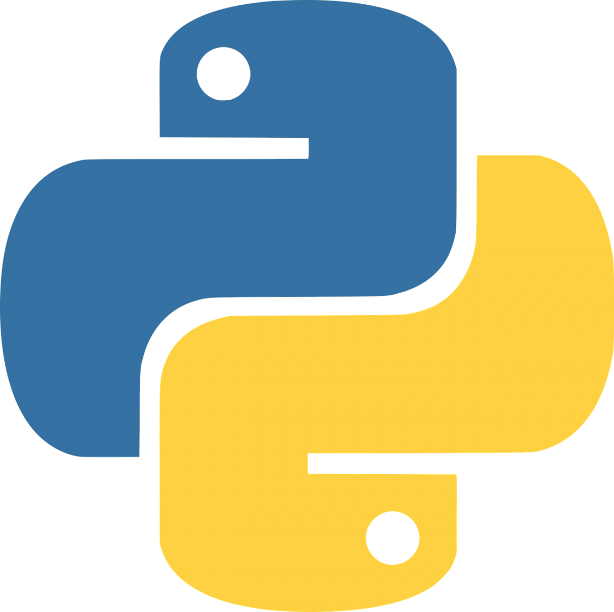

# 👋 Hi, I'm Phạm Anh Ngữ

## About me
- I'm a student at Can Tho University, majoring in Information Systems
- Currently learning Web Development and AI
- Interested in Backend Development and AI applications

## Skills

### - Programming Languages

  
  
  
  
  

### - Web Technologies

  
  

### - Frameworks

  

### - Tools

  

## Projects
- English Center Management System
- Restaurant Management System

## Contact
- Email: anhngu.pham2004@gmail.com

## GitHub Stats

## Top languages

# Thanks for visiting my profile!
